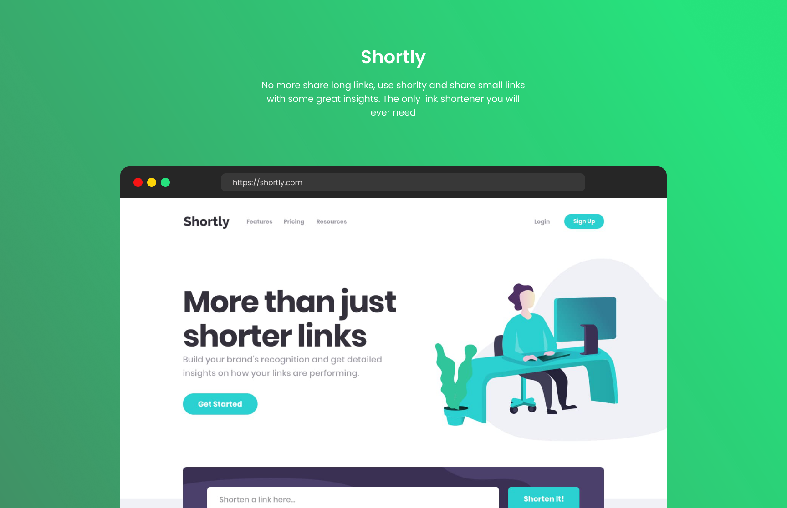

# Shortly URL shortener

Make links better, shorter, and see better-detailed insights for the link only with shortly.

## The challenge

- View the optimal layout for the site depending on their device's screen size
- Shorten any valid URL
- See a list of their shortened links, even after refreshing the browser
- Copy the shortened link to their clipboard in a single click
- Receive an error message when the `form` is submitted if:
  - The `input` field is empty

#### Challenge Link
- Challenge by Frontend Mentor
- [Shortly URL shortening API Challenge challenge on Frontend Mentor](https://www.frontendmentor.io/challenges/url-shortening-api-landing-page-2ce3ob-G).

### Links

- [Solution URL](https://url-shortner-two-tau.vercel.app)
- [Live Site URL](https://www.frontendmentor.io/solutions/url-shortener-api-landing-page-SJpmbvEB5)

### Built with

- Mobile-first workflow
- [React](https://reactjs.org/) - JS library
- [Tailwind CSS](https://tailwindcss.com) - CSS Framework

### Author

- GitHub - [@arshWebDev](https://github.com/arshWebDev)
- Twitter - [@arshWebDev](https://www.twitter.com/arshWebDev)
- Frontend Mentor - [@arshWebDev](https://www.frontendmentor.io/profile/arshWebDev)
